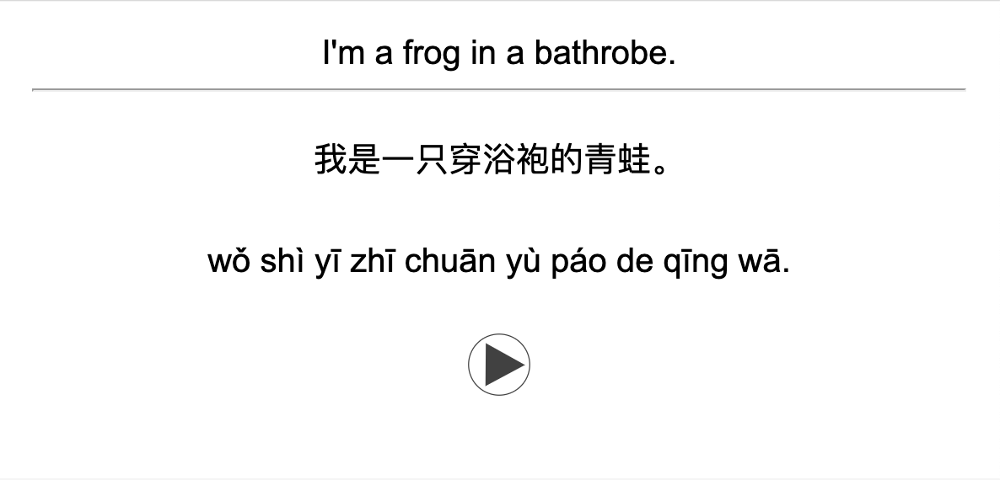
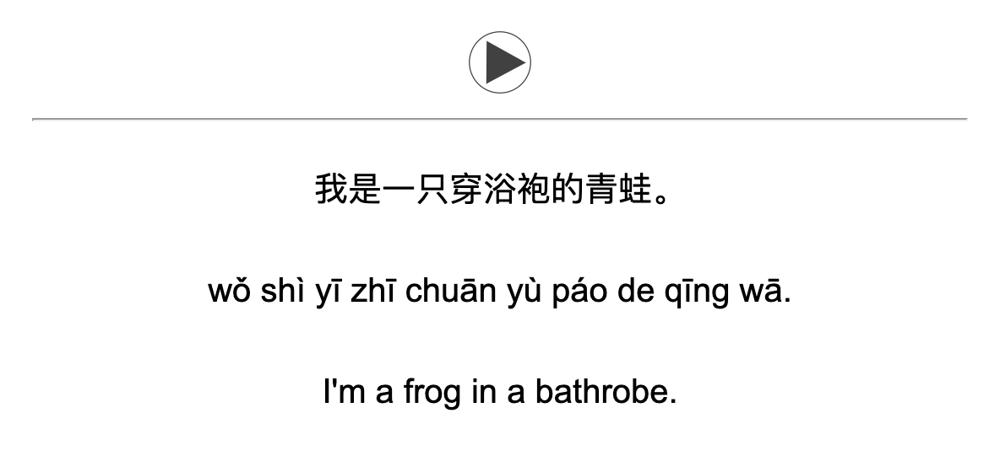

# cardgen

A simple tool to generate Anki flashcards for learning Chinese.

## Usage

Set your OpenAI API key in .env

```bash
OPENAI_API_KEY=sk-xxxxxxxxxxxxxxxxxxxxxxxxxxxxxxxxxxxxxxxx

Add phrases to the `phrases.txt` file in English or Chinese. File can be a mix of both. Phrases just need to be newline separated.

To run:

```bash
python cardgen.py
```
You can additionally specificy a particular input file to use as a positional argument.

```bash
python cardgen.py my_phrases.txt
```

To use in Anki, click Import File and select `flashcards.txt`.

To get the audio working correctly, you will need to add the audio files in the generated `zhaudio` folder to Anki's `collection.media` folder.

```bash
open ~/Library/Application\ Support/Anki2/User\ 1/collection.media
```

It's a bit annoying but if you want the to use the audio on mobile, the collection.media folder cannot have nested directories, so you just have to move the files from `zhaudio` to the top level. 

## Flashcards

This generates two types of flashcards:

1. Type 1: English phrase front


2. Type 2: Chinese audio front


Happy hunting!
